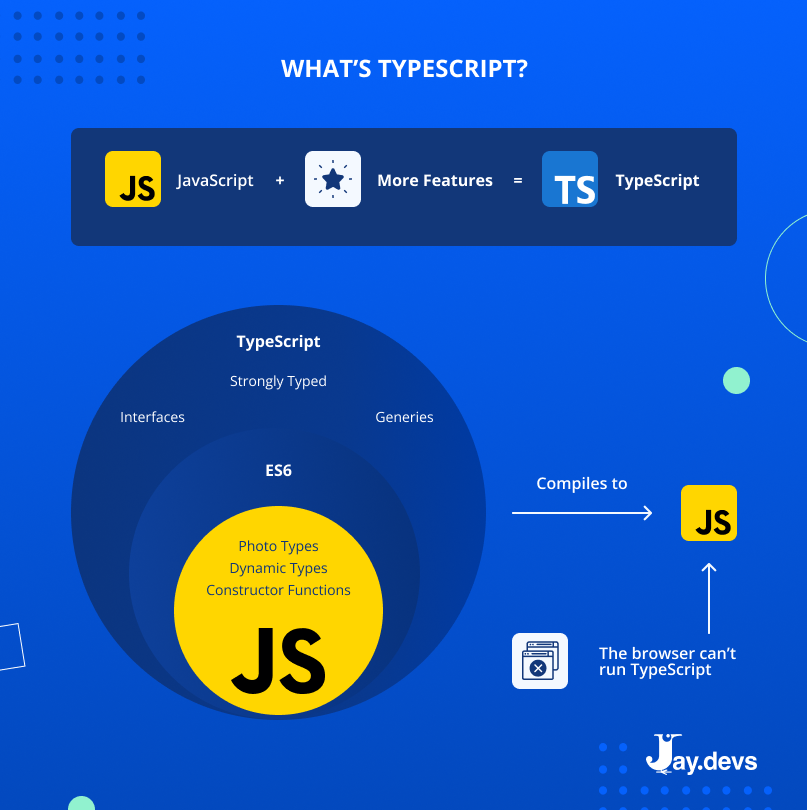
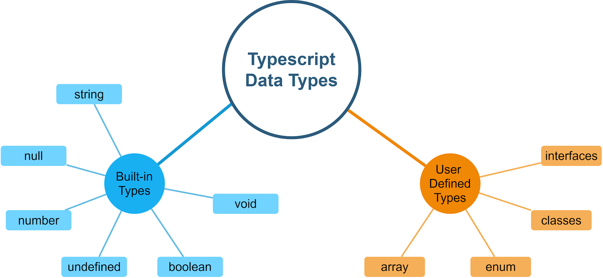

#      TypeScript

### - **TypeScript - *2012 yilda Microsoft tomonidan taqdim etilgan dasturlash tili va JavaScript imkoniyatlarini kengaytiruvchi veb-ilovalarni ishlab chiqish vositasi sifatida joylashtirilgan. TypeScript tilini ishlab chiqaruvchisi Anders Xeylsberg bo'lib, u ilgari Turbo Pascal, Delphi va C# tillarini yaratgan.***



### - **TypeScript, JavaScriptga qaraganda, dasturchilarga dasturlarini qisqa va ishonchliroq qilishda yordam beradi. Uning asosiy vazifalari quyidagilardir:**
 
  1. **Statik Tiplash: TypeScript, dasturchilarga dasturlarini yozishda xato qilish imkonini kamaytiradi. U, koding muammolarini vaqtli ravishda aniqlab beradi. Statik tiplash, dasturda aniqlik va barqarorlikni oshiradi.**

  2. **Kode Kengaytirilganligi: TypScript, dasturchilarga ob'ektlar, funksiyalar va interfeyslar kabi qo'shimcha tayplar yaratish imkonini beradi. Bu, kodni o'qish va tushuntirishni osonlashtiradi, shuningdek, tarkibiy tashqi kutubxonalarni yaratishni ham osonlashtiradi.**

  3. **ES6+ Kengaytirish: TypeScript, JavaScriptning keyingi versiyalarining ko'pini qo'llab-quvvatlaydi. Bu, dasturchilarga yangi tilda mavjud bo'lgan ko'plab imkoniyatlar, masalan, klasslar, lambda funktsiyalari, ko'p qatorli matnlar va boshqalar kabi, foydalanish imkonini beradi.**

  4. **Kode Ma'lumotlari Tizimi: TypeScript, dasturchilarga koddagi ma'lumotlarni to'g'ri ravishda ma'lumotlar tizimi sifatida qo'llash imkonini beradi. Bu, kodni nazorat qilishni osonlashtiradi va katta loyihalarda qolgan muammolarni kamaytiradi.**

  5. **Kattalashgan Proyektlar Uchun Oson To'g'ri Ishlash: TypeScript, katta qatlamli loyihalarda ishlovchi dasturchilarga yordam beradi. Katta tashqi kutubxonalarda, jamoatchilik yoki korxona muhitlarida oson tarkibiy bo'lib, kengaytirilgan ma'lumotlar modellashini yaratishga imkon beradi.**

  6. **Kodni Avtomatlashtirish: TypeScript, dasturchilarga kodni yozish va uni avtomatik ravishda ma'lumotlar tizimi sifatida foydalanish imkonini beradi. Bu, kodni yozish va uni qayta ishlashni osonlashtiradi va dasturchilarning samarali ishlashini oshiradi.**

<hr> 

###  ***TaypScript data types*** 



 - **Boolean: true yoki false qiymatlarini qabul qiladi.**
 -  **Number: Butun sonlar va o'nlik sanoq sistemasidagi sonlar.**
 -  **String: Matnlar.**
 -  **Array: Massivlar.**
 -  **Tuple: Belgilangan tartibda bir xil tayplarga ega massivlar.**
 -  **Enum: O'zgaruvchilarni qiymatlarga murojaat qilish uchun bir** 
 -  **qisqa nom beradi.**
 -  **Any: Har qanday turdagi qiymatlarni qabul qiladi.**
 -  **Void: Agar bir funksiya hech qanday qiymat qaytarmasa.**
  -  **Null va Undefined: Bitta qiymatlar uchun.**
  -  **Never: Nimadir qaytarmaydigan funksiyalar uchun.**
  -  **Object: JS obyektlari uchun umumiy turi.**


1. **Boolean:** *Boshqa tillardagi booleantip, true yoki false qiymatlarini qabul qiladi.*

```
let isDone: boolean = false;
console.log(isDone); // false
```

2.  **Number:** *Butun va o'nlik sonlarni ifodalaydi. Masalan, 5, 10.5, -3.14 kabi.*

```
let decimal: number = 6;
let hex: number = 0xf00d;
let binary: number = 0b1010;
let octal: number = 0o744;
console.log(decimal, hex, binary, octal); // 6 61453 10 484
```

3. **String:** *Matnlar, qo'shimcha belgilar yoki satrlar. Misol uchun: "Salom", "TypScript", "123".*

```
let color: string = "blue";
color = 'red'; // Double quotes va single quotes ishlatish mumkin
console.log(color); // red
```
4. **Array:** *Massivlar, biror turdagi elementlarni o'z ichiga oladi. [1, 2, 3] yoki ['salom', 'dunyo'] kabi.*

```
let list: number[] = [1, 2, 3];
console.log(list); // [1, 2, 3]

let names: Array<string> = ['John', 'Doe'];
console.log(names); // ['John', 'Doe']
```

5. **Tuple:**  *Tartiblangan elementlarga ega massivlar. Misol uchun, [string, number] turidagi tartiblangan massivda birinchi element matn va ikkinchi element son bo'ladi.*

```
let x: [string, number];
x = ['hello', 10]; // To'g'ri
x = [10, 'hello']; // Xato
console.log(x[0].substring(1)); // ello
```


